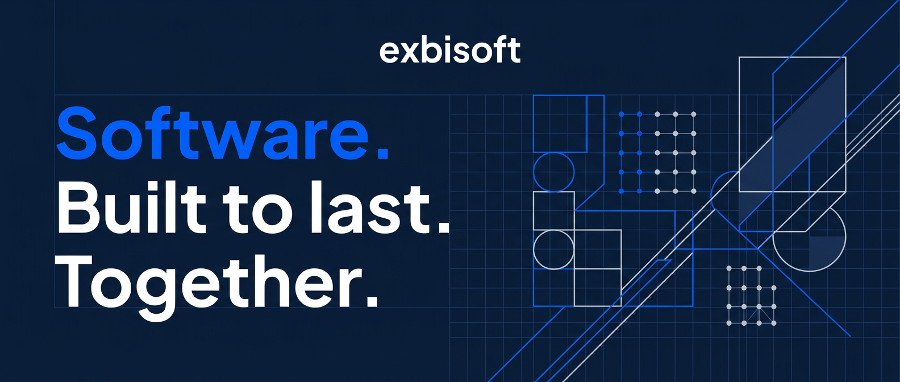

# exbisoft

**Custom software development for mid-sized businesses that can't afford to get it wrong.**

We build full-lifecycle software for mid-sized companies in precision machinery, construction, intralogistics, and medical technology — primarily across the DACH region. Our delivery centre in asia gives us the depth and capacity to take on complex, long-running engagements without cutting corners.

No off-the-shelf compromises. No vanishing after go-live.

---

## What we build

- **Industrial process applications** — ERP extensions, production planning tools, operational dashboards
- **Mobile & cross-platform clients** — iOS, Android, Windows (Swift, MAUI)
- **Web platforms & portals** — Angular-based frontends with .NET/C# backends
- **Azure-native cloud architecture** — Azure DevOps, Azure AI Foundry, SQL Server on Azure
- **Legacy modernisation** — incremental migrations from ageing stacks without business interruption

---

## How we work

We operate on time-and-materials and managed services retainers. Fixed-price contracts favour the wrong outcomes for complex software. We prefer the model that keeps both sides honest.

---

## Tech stack

`.NET / C#` · `Angular` · `Swift` · `MAUI / Xamarin` · `SQL Server` · `Azure` · `Azure DevOps` · `GitHub`

---

## Find us

- 🌐 [exbisoft.com](https://exbisoft.com)
- 💼 [LinkedIn](https://linkedin.com/company/exbisoft)
- 📬 [info@exbisoft.com](mailto:info@exbisoft.com)

---

*Software. Built to last. Together.*
